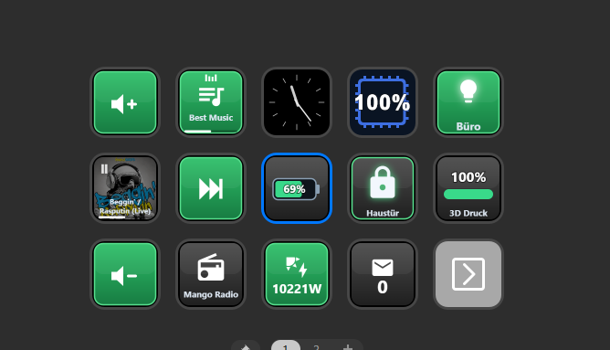

# Home Assistant Tiles for Stream Deck

Show **and** control your [Home Assistant](https://www.home-assistant.io/) right from an
Elgato Stream Deck. Each key renders a clean, purpose-built tile — a glowing light, a padlock,
a thermostat, a live camera snapshot, a now-playing bar — and a press fires the matching action.

No build step, no add-on: the plugin talks to Home Assistant directly over its WebSocket API.

> Independent hobby project — **not affiliated with Home Assistant, Nabu Casa, or Elgato.**

## Features

Two actions, driven by a small property inspector:

**HA Entity** — pick any entity, the tile picks a fitting look:
- **Value** — state as number or text, with optional warning thresholds & colors; power/energy sensors auto-compact (W→kW→MW)
- **Light / Switch** — bulb / strip / hexagon / ring / real HA icon, on-color or global accent, scene actions (activate, toggle, cycle, tap on/off + hold to browse)
- **Lock** — open/closed padlock, state colors, confirm on unlock (double-press or press-&-hold)
- **Climate** — big current temperature, small setpoint, heat/cool shown via the border glow, optional +/- control
- **Cover** — shutter open/closed + position, open / close / stop
- **Vacuum** — status + battery, start / return-to-base / pause / locate
- **Camera** — live snapshot on the key (adjustable refresh), tap to trigger a script (e.g. open the door)
- **Weather** — condition icon + temperature
- **Presence** — person home / away
- **Battery** / **Bar** — 0–100 % gauges
- **Action** — one tap runs a `script.`, `button.`, `input_button.`, `scene.` or `automation.`

**HA Info Carousel** — a dedicated action that cycles several read-only info tiles on one key. Each slot is a full, independent config (entity, display mode, thresholds, colours, icon); a tap shows the next, with position dots at the top.

**HA Media / Music Assistant** — play/pause, next/prev, volume, stop, now-playing (cover art + progress + title/artist), and start Music Assistant content with an animated "now playing" badge (single playlist or a tap/hold playlist carousel).

Extras: per-key or global background theme, global "active" color, MDI icon resolution, live updates,
and a red **offline dot** (bottom-right) when the Home Assistant connection drops.

## Install

1. Download the latest `.streamDeckPlugin` from the [Releases](../../releases) page.
2. Double-click it — Stream Deck installs the plugin.
3. Drag **HA Entity** or **HA Media / Music Assistant** onto a key.

### Setup

1. In Home Assistant → your profile → **Long-Lived Access Tokens** → create one.
2. On the first key, open the property inspector and enter your **Server URL**
   (e.g. `http://homeassistant.local:8123`) and the **token**.
   It's stored globally and pre-filled on every new key.
3. Pick an entity — the tile auto-selects a fitting display.

## Known limitations

- **Camera snapshots** are drawn onto a canvas, so Home Assistant must allow the image request
  from the plugin (CORS). Most setups work; if a camera key stays black, that's why.
- Localized UI ships in **German** and **English**; other Stream Deck languages fall back to English.

## Development

The plugin uses the classic Stream Deck SDK — plain HTML/JS, no build step. Edit the files under
`com.hoizi.homeassistant.sdPlugin/` and restart Stream Deck to reload.

## Credits & license

- Icons: [Material Design Icons](https://pictogrammers.com/library/mdi/) by the Pictogrammers team (Apache-2.0).
- Licensed under the [MIT License](LICENSE).
